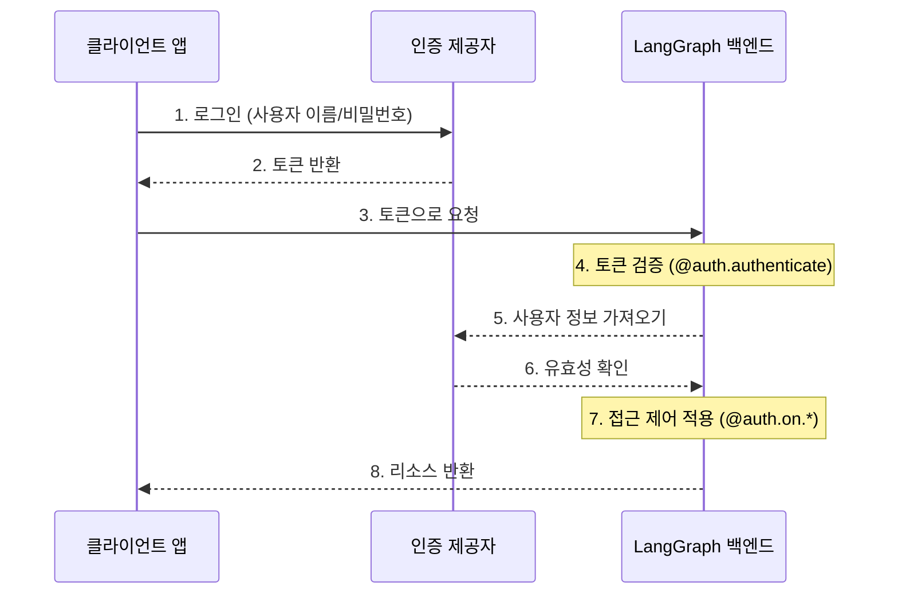

# 인증 및 접근 제어

LangGraph 플랫폼은 대부분의 인증 방식과 통합 가능한 유연한 인증 및 권한 부여 시스템을 제공합니다.

!!! 주의 "Python 전용"

    현재 `langgraph-api>=0.0.11`이 포함된 Python 배포에서만 사용자 정의 인증 및 권한 부여를 지원합니다. LangGraph.JS에 대한 지원은 곧 추가될 예정입니다.

## 핵심 개념

### 인증 vs 권한 부여

두 용어는 종종 같은 의미로 사용되지만, 서로 다른 보안 개념을 나타냅니다:

- [**인증**](#authentication) ("AuthN")은 _당신이 누구인지_ 확인합니다. 이는 모든 요청에 대해 미들웨어로 실행됩니다.
- [**권한 부여**](#authorization) ("AuthZ")는 _당신이 무엇을 할 수 있는지_ 결정합니다. 이는 자원별로 사용자의 권한 및 역할을 검증합니다.

LangGraph 플랫폼에서는 인증이 [`@auth.authenticate`](../cloud/reference/sdk/python_sdk_ref.md#langgraph_sdk.auth.Auth.authenticate) 핸들러에 의해 처리되고, 권한 부여는 [`@auth.on`](../cloud/reference/sdk/python_sdk_ref.md#langgraph_sdk.auth.Auth.on) 핸들러에 의해 처리됩니다.

## 기본 보안 모델

LangGraph 플랫폼은 다양한 보안 기본값을 제공합니다:

### LangGraph 클라우드

- 기본적으로 LangSmith API 키를 사용
- `x-api-key` 헤더에 유효한 API 키 필요
- 사용자 정의 인증 핸들러로 맞춤 설정 가능

### 자체 호스팅

- 기본 인증 없음
- 보안 모델을 완전히 구현할 수 있는 유연성 제공
- 인증 및 권한 부여의 모든 측면을 제어

## 시스템 아키텍처

전형적인 인증 설정은 세 가지 주요 구성 요소를 포함합니다:

1. **인증 제공자** (Identity Provider/IdP)

    * 사용자 신원 및 자격 증명을 관리하는 전용 서비스
    * 사용자 등록, 로그인, 비밀번호 재설정 등을 처리
    * 성공적인 인증 후 토큰(JWT, 세션 토큰 등)을 발급
    * 예: Auth0, Supabase Auth, Okta 또는 자체 인증 서버

2. **LangGraph 백엔드** (리소스 서버)

    * 비즈니스 논리 및 보호된 리소스를 포함하는 LangGraph 애플리케이션
    * 인증 제공자와 함께 토큰을 검증
    * 사용자 신원 및 권한에 기반하여 접근 제어를 시행
    * 사용자 자격 증명을 직접 저장하지 않음

3. **클라이언트 애플리케이션** (프론트엔드)

    * 웹 앱, 모바일 앱 또는 API 클라이언트
    * 시간 민감한 사용자 자격 증명을 수집하고 인증 제공자에게 전송
    * 인증 제공자로부터 토큰 수신
    * LangGraph 백엔드에 대한 요청에 이 토큰 포함

이러한 구성 요소가 전형적으로 상호작용하는 방식은 다음과 같습니다:



LangGraph에서의 [`@auth.authenticate`](../cloud/reference/sdk/python_sdk_ref.md#langgraph_sdk.auth.Auth.authenticate) 핸들러는 단계 4-6을 처리하고, [`@auth.on`](../cloud/reference/sdk/python_sdk_ref.md#langgraph_sdk.auth.Auth.on) 핸들러는 단계 7을 구현합니다.

## 인증

LangGraph에서의 인증은 모든 요청에 대해 미들웨어로 실행됩니다. [`@auth.authenticate`](../cloud/reference/sdk/python_sdk_ref.md#langgraph_sdk.auth.Auth.authenticate) 핸들러는 요청 정보를 수신하고 다음을 수행해야 합니다:

1. 자격 증명 검증
2. 유효한 경우 사용자의 신원 및 사용자 정보를 포함하는 [사용자 정보](../cloud/reference/sdk/python_sdk_ref.md#langgraph_sdk.auth.types.MinimalUserDict) 반환
3. 유효하지 않은 경우 [HTTP 예외](../cloud/reference/sdk/python_sdk_ref.md#langgraph_sdk.auth.exceptions.HTTPException) 또는 AssertionError 발생

```python
from langgraph_sdk import Auth

auth = Auth()

@auth.authenticate
async def authenticate(headers: dict) -> Auth.types.MinimalUserDict:
    # 자격 증명 검증 (예: API 키, JWT 토큰)
    api_key = headers.get("x-api-key")
    if not api_key or not is_valid_key(api_key):
        raise Auth.exceptions.HTTPException(
            status_code=401,
            detail="유효하지 않은 API 키"
        )

    # 사용자 정보 반환 - 신원과 인증 여부만 필수
    # 권한 부여에 필요한 추가 필드를 추가할 수 있습니다.
    return {
        "identity": "user-123",        # 필수: 고유 사용자 식별자
        "is_authenticated": True,      # 선택 사항: 기본적으로 True로 가정
        "permissions": ["read", "write"], # 선택 사항: 권한 기반 인증용
        # 다른 인증 패턴을 구현하려면 사용자 정의 필드를 더 추가할 수 있습니다.
        "role": "admin",
        "org_id": "org-456"
    }
```

반환된 사용자 정보는 다음에서 사용할 수 있습니다:

- [`ctx.user`](../cloud/reference/sdk/python_sdk_ref.md#langgraph_sdk.auth.types.AuthContext) 를 통한 권한 부여 핸들러
- 애플리케이션 내에서 `config["configuration"]["langgraph_auth_user"]`

??? 팁 "지원되는 매개변수"

    [`@auth.authenticate`](../cloud/reference/sdk/python_sdk_ref.md#langgraph_sdk.auth.Auth.authenticate) 핸들러는 다음 매개변수를 이름으로 수용할 수 있습니다:

    * request (Request): 원시 ASGI 요청 객체
    * body (dict): 구문 분석된 요청 본문
    * path (str): 요청 경로, 예: "/threads/abcd-1234-abcd-1234/runs/abcd-1234-abcd-1234/stream"
    * method (str): HTTP 메서드, 예: "GET"
    * path_params (dict[str, str]): URL 경로 매개변수, 예: {"thread_id": "abcd-1234-abcd-1234", "run_id": "abcd-1234-abcd-1234"}
    * query_params (dict[str, str]): URL 쿼리 매개변수, 예: {"stream": "true"}
    * headers (dict[bytes, bytes]): 요청 헤더
    * authorization (str | None): 인증 헤더 값 (예: "Bearer <token>")
    
    많은 튜토리얼에서는 간결성을 위해 "authorization" 매개변수만 표시하지만, 필요에 따라 더 많은 정보를 수용하도록 선택할 수 있습니다.
    사용자 정의 인증 체계를 구현합니다.

## 권한 부여

인증 후, LangGraph는 특정 리소스(예: 스레드, 어시스턴트, 크론)에 대한 접근을 제어하기 위해 [`@auth.on`](../cloud/reference/sdk/python_sdk_ref.md#langgraph_sdk.auth.Auth.on) 핸들러를 호출합니다. 이러한 핸들러는 다음을 수행할 수 있습니다:

1. 리소스 생성 중에 `value["metadata"]` 사전을 직접 수정하여 메타데이터를 추가합니다. 각 작업에 대한 값이 가져야 하는 유형의 목록은 [지원되는 작업 표](##supported-actions)에서 확인하세요.
2. 검색/목록 또는 읽기 작업 중 메타데이터로 리소스를 필터링하여 [필터 사전](#filter-operations)을 반환합니다.
3. 접근 거부 시 HTTP 예외를 발생시킵니다.

단순한 사용자 범위의 접근 제어를 구현하고 싶다면, 모든 리소스와 작업에 대해 단일 [`@auth.on`](../cloud/reference/sdk/python_sdk_ref.md#langgraph_sdk.auth.Auth.on) 핸들러를 사용할 수 있습니다. 리소스와 작업에 따라 다른 제어를 원한다면 [리소스별 핸들러](#resource-specific-handlers)를 사용할 수 있습니다. 접근 제어를 지원하는 리소스의 전체 목록은 [지원되는 리소스](#supported-resources) 섹션을 참조하세요.

```python
@auth.on
async def add_owner(
    ctx: Auth.types.AuthContext,
    value: dict  # 이 접근 메서드에 전송되는 페이로드
) -> dict:  # 리소스에 대한 접근을 제한하는 필터 사전을 반환합니다.
    """스레드, 실행(run), 크론, 어시스턴트에 대한 모든 접근을 승인합니다.

    이 핸들러는 두 가지 작업을 수행합니다:
        - 리소스 메타데이터에 값을 추가합니다 (나중에 필터링할 수 있도록 리소스와 함께 지속됨).
        - 필터를 반환합니다 (기존 리소스 접근 제한).

    매개변수:
        ctx: 사용자 정보, 권한, 경로 등을 포함하는 인증 컨텍스트
        value: 끝점에 전송된 요청 페이로드. 생성 작업의 경우 리소스 매개변수가 포함됩니다. 읽기
              작업의 경우 접근하는 리소스가 포함됩니다.

    반환 값:
        LangGraph가 리소스 접근을 제한하는 데 사용하는 필터 사전.
        지원되는 연산자는 [필터 작업](#filter-operations)을 참조하세요.
    """
    # 사용자의 리소스에만 접근을 제한하는 필터 생성
    filters = {"owner": ctx.user.identity}

    # 페이로드에서 메타데이터 사전을 가져오거나 생성
    # 이는 리소스에 대한 지속적인 정보를 저장하는 곳입니다.
    metadata = value.setdefault("metadata", {})

    # 메타데이터에 소유자를 추가 - 생성 또는 업데이트 작업인 경우,
    # 이 정보는 리소스와 함께 저장됩니다.
    # 따라서 나중에 읽기 작업에서 이 정보를 기준으로 필터링할 수 있습니다.
    metadata.update(filters)

    # 접근을 제한하기 위해 필터 반환
    # 이러한 필터는 모든 작업(생성, 읽기, 업데이트, 검색 등)에 적용됩니다.
    # 사용자들이 자신의 리소스만 접근할 수 있도록 보장합니다.
    return filters
```

### 리소스별 핸들러 {#resource-specific-handlers}

특정 리소스와 작업에 대한 핸들러를 [`@auth.on`](../cloud/reference/sdk/python_sdk_ref.md#langgraph_sdk.auth.Auth.on) 데코레이터로 리소스 및 작업 이름을 결합하여 등록할 수 있습니다. 요청이 발생하면 해당 리소스와 작업에 가장 구체적으로 일치하는 핸들러가 호출됩니다. 다음은 특정 리소스 및 작업에 대한 핸들러를 등록하는 방법에 대한 예입니다. 다음 설정에서는:

1. 인증된 사용자는 스레드를 생성하고, 스레드를 읽고, 스레드에 실행을 생성할 수 있습니다.
2. "assistants:create" 권한이 있는 사용자만 새로운 도우미를 생성할 수 있습니다.
3. 기타 모든 엔드포인트(예: 도우미 삭제, 크론, 저장소)는 모든 사용자에게 비활성화됩니다.

!!! 팁 "지원되는 핸들러"

    지원되는 리소스 및 작업의 전체 목록은 아래의 [지원되는 리소스](#supported-resources) 섹션을 참조하세요.

```python
# 일반 / 전역 핸들러는 더 구체적인 핸들러에 의해 처리되지 않는 호출을 포착합니다.
@auth.on
async def reject_unhandled_requests(ctx: Auth.types.AuthContext, value: Any) -> False:
    print(f"{ctx.user.identity}의 {ctx.path}에 대한 요청")
    raise Auth.exceptions.HTTPException(
        status_code=403,
        detail="금지됨"
    )

# "thread" 리소스와 모든 작업 - 생성, 읽기, 업데이트, 삭제, 검색과 일치합니다.
# 이것은 일반 @auth.on 핸들러보다 **더 구체적**이므로
# "threads" 리소스의 모든 작업에 대해 일반 핸들러보다 우선합니다.
@auth.on.threads
async def on_thread_create(
    ctx: Auth.types.AuthContext,
    value: Auth.types.threads.create.value
):
    if "write" not in ctx.permissions:
        raise Auth.exceptions.HTTPException(
            status_code=403,
            detail="사용자가 필요한 권한이 없습니다."
        )
    # 생성 중인 스레드의 메타데이터 설정
    # 이것은 리소스에 "owner" 필드가 포함되도록 보장합니다.
    # 그런 다음 사용자가 이 스레드 또는 스레드 내의 실행에 액세스하려고 할 때마다
    # 우리는 소유자를 기준으로 필터링할 수 있습니다.
    metadata = value.setdefault("metadata", {})
    metadata["owner"] = ctx.user.identity
    return {"owner": ctx.user.identity}

# 스레드 생성. 이것은 스레드 생성 작업에만 일치합니다.
# 이것은 일반 @auth.on 핸들러와 @auth.on.threads 핸들러보다 **더 구체적**이므로,
# "threads" 리소스에서 "create" 작업에 대해 우선합니다.
@auth.on.threads.create
async def on_thread_create(
    ctx: Auth.types.AuthContext,
    value: Auth.types.threads.create.value
):
    # 생성 중인 스레드의 메타데이터 설정
    # 이것은 리소스에 "owner" 필드가 포함되도록 보장합니다.
    # 그런 다음 사용자가 이 스레드 또는 스레드 내의 실행에 액세스하려고 할 때마다
    # 우리는 소유자를 기준으로 필터링할 수 있습니다.
    metadata = value.setdefault("metadata", {})
    metadata["owner"] = ctx.user.identity
    return {"owner": ctx.user.identity}

# 스레드 읽기. 이것은 일반 @auth.on 핸들러와 @auth.on.threads 핸들러보다 또한 더 구체적이므로,
# "threads" 리소스에서 "read" 작업에 대해 우선합니다.
@auth.on.threads.read
async def on_thread_read(
    ctx: Auth.types.AuthContext,
    value: Auth.types.threads.read.value
):
    # 우리가 스레드를 읽고 있기 때문에 (생성하는 것이 아니기 때문에),
    # 메타데이터를 설정할 필요가 없습니다. 우리는 단지
    # 사용자가 자신의 스레드만 볼 수 있도록 필터를 반환해야 합니다.
    return {"owner": ctx.user.identity}

# 실행 생성, 스트리밍, 업데이트 등.
# 이것은 일반 @auth.on 핸들러 및 @auth.on.threads 핸들러보다 우선합니다.
@auth.on.threads.create_run
async def on_run_create(
    ctx: Auth.types.AuthContext,
    value: Auth.types.threads.create_run.value
):
    metadata = value.setdefault("metadata", {})
    metadata["owner"] = ctx.user.identity
    # 스레드의 접근 제어 상속
    return {"owner": ctx.user.identity}

# 도우미 생성
@auth.on.assistants.create
async def on_assistant_create(
    ctx: Auth.types.AuthContext,
    value: Auth.types.assistants.create.value
):
    if "assistants:create" not in ctx.permissions:
        raise Auth.exceptions.HTTPException(
            status_code=403,
            detail="사용자가 필요한 권한이 없습니다."
        )
```

위 예에서 전역 및 리소스 특정 핸들러를 혼합하고 있음을 주목하십시오. 각 요청은 가장 구체적인 핸들러에 의해 처리되므로 `thread`를 생성하려는 요청은 `on_thread_create` 핸들러와 일치하지만 `reject_unhandled_requests` 핸들러와는 일치하지 않습니다. 그러나 스레드를 `update`하려는 요청은 해당 리소스 및 작업에 대해 더 구체적인 핸들러가 없으므로 전역 핸들러에 의해 처리됩니다. 생성, 업데이트 요청은 

### 필터 작업 {#filter-operations}

인증 핸들러는 `None`, 부울 값 또는 필터 사전을 반환할 수 있습니다.
- `None` 및 `True`는 "모든 하위 리소스에 대한 접근을 허용"을 의미합니다.
- `False`는 "모든 하위 리소스에 대한 접근을 거부합니다 (403 예외 발생)"를 의미합니다.
- 메타데이터 필터 사전은 리소스 접근을 제한합니다.

필터 사전은 리소스 메타데이터와 일치하는 키를 가진 사전입니다. 세 가지 연산자를 지원합니다:

- 기본값은 정확히 일치하는 것을 위한 약어이며, 또는 "$eq"입니다. 예를 들어, `{"owner": user_id}`는 메타데이터가 `{"owner": user_id}`를 포함하는 리소스만 포함합니다.
- `$eq`: 정확히 일치 (예: `{"owner": {"$eq": user_id}}`) - 이는 위의 약어인 `{"owner": user_id}`와 동일합니다.
- `$contains`: 목록 멤버십 (예: `{"allowed_users": {"$contains": user_id}}`) 이 값은 목록의 요소이어야 합니다. 저장된 리소스의 메타데이터는 목록/컨테이너 타입이어야 합니다.

여러 키를 가진 사전은 논리적 `AND` 필터를 사용하여 처리됩니다. 예를 들어, `{"owner": org_id, "allowed_users": {"$contains": user_id}}`는 "owner"가 `org_id`이고 "allowed_users" 목록에 `user_id`가 포함된 메타데이터를 가진 리소스만 일치합니다.
자세한 내용은 [여기](../cloud/reference/sdk/python_sdk_ref.md#langgraph_sdk.auth.types.FilterType)를 참조하십시오.

## 일반적인 접근 패턴

다음은 일반적인 인증 패턴입니다:

### 단일 소유자 리소스

이 일반적인 패턴은 모든 스레드, 어시스턴트, 크론 및 실행을 단일 사용자로 제한할 수 있도록 해줍니다. 일반적인 단일 사용자 사용 사례(예: 일반적인 챗봇 스타일 앱)에 유용합니다.

```python
@auth.on
async def owner_only(ctx: Auth.types.AuthContext, value: dict):
    metadata = value.setdefault("metadata", {})
    metadata["owner"] = ctx.user.identity
    return {"owner": ctx.user.identity}
```

### 권한 기반 접근

이 패턴은 **권한**에 따라 접근을 제어할 수 있도록 해줍니다. 특정 역할이 리소스에 대해 더 광범위하거나 더 제한된 접근을 원할 경우 유용합니다.

```python
# 인증 핸들러 내에서:
@auth.authenticate
async def authenticate(headers: dict) -> Auth.types.MinimalUserDict:
    ...
    return {
        "identity": "user-123",
        "is_authenticated": True,
        "permissions": ["threads:write", "threads:read"]  # 인증에서 권한 정의
    }

def _default(ctx: Auth.types.AuthContext, value: dict):
    metadata = value.setdefault("metadata", {})
    metadata["owner"] = ctx.user.identity
    return {"owner": ctx.user.identity}

@auth.on.threads.create
async def create_thread(ctx: Auth.types.AuthContext, value: dict):
    if "threads:write" not in ctx.permissions:
        raise Auth.exceptions.HTTPException(
            status_code=403,
            detail="Unauthorized"
        )
    return _default(ctx, value)


@auth.on.threads.read
async def rbac_create(ctx: Auth.types.AuthContext, value: dict):
    if "threads:read" not in ctx.permissions and "threads:write" not in ctx.permissions:
        raise Auth.exceptions.HTTPException(
            status_code=403,
            detail="Unauthorized"
        )
    return _default(ctx, value)
```

## 지원되는 리소스

LangGraph는 인증 핸들러의 세 가지 수준을 제공합니다. 가장 일반적인 것부터 가장 구체적인 것까지:

1. **전역 핸들러** (`@auth.on`): 모든 리소스와 작업에 일치합니다.
2. **리소스 핸들러** (예: `@auth.on.threads`, `@auth.on.assistants`, `@auth.on.crons`): 특정 리소스에 대한 모든 작업에 일치합니다.
3. **작업 핸들러** (예: `@auth.on.threads.create`, `@auth.on.threads.read`): 특정 리소스에 대한 특정 작업에 일치합니다.

가장 구체적인 일치 핸들러가 사용됩니다. 예를 들어, `@auth.on.threads.create`는 스레드를 생성할 때 `@auth.on.threads`보다 우선합니다.
더 구체적인 핸들러가 등록되면 해당 리소스와 작업에 대한 더 일반적인 핸들러는 호출되지 않습니다.

???+ 팁 "타입 안전성"
    각 핸들러는 `value` 매개변수에 대한 타입 힌트를 제공받습니다. `Auth.types.on.<resource>.<action>.value`. 예를 들어:
    ```python
    @auth.on.threads.create
    async def on_thread_create(
        ctx: Auth.types.AuthContext,
        value: Auth.types.on.threads.create.value  # 스레드 생성을 위한 특정 타입
    ):
        ...
    
    @auth.on.threads
    async def on_threads(
        ctx: Auth.types.AuthContext,
        value: Auth.types.on.threads.value  # 모든 스레드 작업의 유니온 타입
    ):
        ...
    
    @auth.on
    async def on_all(
        ctx: Auth.types.AuthContext,
        value: dict  # 모든 가능한 작업의 유니온 타입
    ):
        ...
    ```
    더 구체적인 핸들러는 더 적은 작업 유형을 처리하기 때문에 더 나은 타입 힌트를 제공합니다.

#### 지원되는 작업 및 타입 {#supported-actions}
다음은 모든 지원되는 작업 핸들러입니다:

| 리소스 | 핸들러 | 설명 | 값 타입 |
|----------|---------|-------------|------------|
| **스레드** | `@auth.on.threads.create` | 스레드 생성 | [`ThreadsCreate`](../cloud/reference/sdk/python_sdk_ref.md#langgraph_sdk.auth.types.ThreadsCreate) |
| | `@auth.on.threads.read` | 스레드 검색 | [`ThreadsRead`](../cloud/reference/sdk/python_sdk_ref.md#langgraph_sdk.auth.types.ThreadsRead) |
| | `@auth.on.threads.update` | 스레드 업데이트 | [`ThreadsUpdate`](../cloud/reference/sdk/python_sdk_ref.md#langgraph_sdk.auth.types.ThreadsUpdate) |
| | `@auth.on.threads.delete` | 스레드 삭제 | [`ThreadsDelete`](../cloud/reference/sdk/python_sdk_ref.md#langgraph_sdk.auth.types.ThreadsDelete) |
| | `@auth.on.threads.search` | 스레드 목록 | [`ThreadsSearch`](../cloud/reference/sdk/python_sdk_ref.md#langgraph_sdk.auth.types.ThreadsSearch) |
| | `@auth.on.threads.create_run` | 실행 생성 또는 업데이트 | [`RunsCreate`](../cloud/reference/sdk/python_sdk_ref.md#langgraph_sdk.auth.types.RunsCreate) |
| **어시스턴트** | `@auth.on.assistants.create` | 어시스턴트 생성 | [`AssistantsCreate`](../cloud/reference/sdk/python_sdk_ref.md#langgraph_sdk.auth.types.AssistantsCreate) |
| | `@auth.on.assistants.read` | 어시스턴트 검색 | [`AssistantsRead`](../cloud/reference/sdk.python_sdk_ref.md#langgraph_sdk.auth.types.AssistantsRead) |
| | `@auth.on.assistants.update` | 어시스턴트 업데이트 | [`AssistantsUpdate`](../cloud/reference/sdk/python_sdk_ref.md#langgraph_sdk.auth.types.AssistantsUpdate) |
| | `@auth.on.assistants.delete` | 어시스턴트 삭제 | [`AssistantsDelete`](../cloud/reference/sdk/python_sdk_ref.md#langgraph_sdk.auth.types.AssistantsDelete) |
| | `@auth.on.assistants.search` | 어시스턴트 목록 | [`AssistantsSearch`](../cloud/reference/sdk.python_sdk_ref.md#langgraph_sdk.auth.types.AssistantsSearch) |
| **크론** | `@auth.on.crons.create` | 크론 작업 생성 | [`CronsCreate`](../cloud/reference/sdk/python_sdk_ref.md#langgraph_sdk.auth.types.CronsCreate) |
| | `@auth.on.crons.read` | 크론 작업 검색 | [`CronsRead`](../cloud/reference/sdk/python_sdk_ref.md#langgraph_sdk.auth.types.CronsRead) |
| | `@auth.on.crons.update` | 크론 작업 업데이트 | [`CronsUpdate`](../cloud/reference/sdk/python_sdk_ref.md#langgraph_sdk.auth.types.CronsUpdate) |
| | `@auth.on.crons.delete` | 크론 작업 삭제 | [`CronsDelete`](../cloud/reference/sdk/python_sdk_ref.md#langgraph_sdk.auth.types.CronsDelete) |
| | `@auth.on.crons.search` | 크론 작업 목록 | [`CronsSearch`](../cloud/reference/sdk/python_sdk_ref.md#langgraph_sdk.auth.types.CronsSearch) |

???+ note "실행에 대하여"
    실행은 접근 제어를 위해 부모 스레드에 범위가 설정됩니다. 이는 권한이 일반적으로 스레드에서 상속되어 데이터 모델의 대화식 특성을 반영함을 의미합니다. 생성 제외 모든 실행 작업(읽기, 목록)은 스레드 핸들러에 의해 제어됩니다.
    새로운 실행을 생성하기 위한 구체적인 `create_run` 핸들러가 있는 이유는 핸들러에서 볼 수 있는 더 많은 인수가 있기 때문입니다.


## 다음 단계

구현 세부 사항에 대해:

- [인증 설정에 대한 소개 튜토리얼](../tutorials/auth/getting_started.md)을 확인하세요.
- [커스텀 인증 핸들러 구현에 대한 가이드](../how-tos/auth/custom_auth.md)를 참고하세요.
