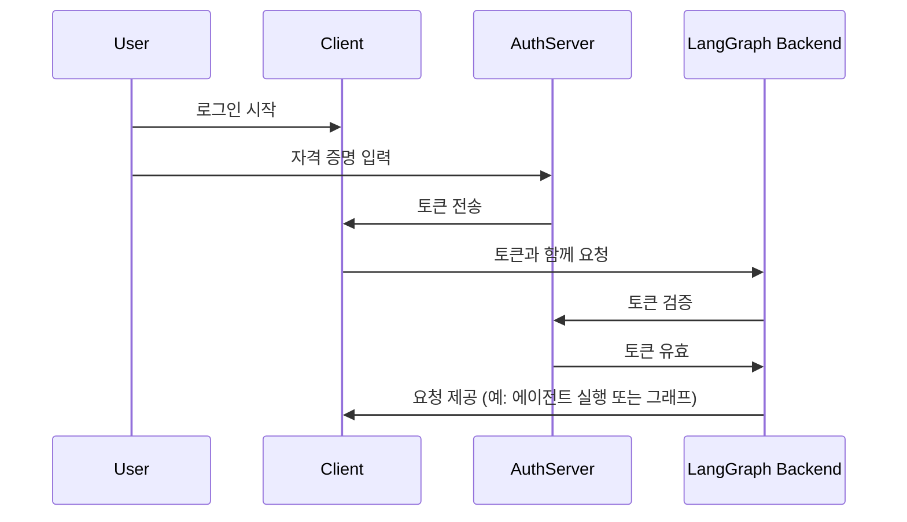

_한국어로 기계번역됨_

# 인증 공급자 연결 (3부 / 3부)

!!! 주의 "이것은 인증 시리즈의 3부입니다:"

1. [기본 인증](getting_started.md) - 봇에 접근할 수 있는 사람을 제어합니다.
2. [리소스 권한 부여](resource_auth.md) - 사용자에게 프라이빗 대화를 허용합니다.
3. 프로덕션 인증 (여기에 있습니다) - 실제 사용자 계정을 추가하고 OAuth2를 사용하여 검증합니다.

[프라이빗 대화 만들기](resource_auth.md) 튜토리얼에서는 사용자가 프라이빗 대화를 가질 수 있도록 [리소스 권한 부여](../../concepts/auth.md#resource-authorization)를 추가했습니다. 하지만 여전히 하드코딩된 토큰을 사용하여 인증하고 있었으므로 보안이 취약했습니다. 이제 이러한 토큰을 [OAuth2](../../concepts/auth.md#oauth2-authentication)를 사용하여 실제 사용자 계정으로 교체하겠습니다.

같은 [`Auth`](../../cloud/reference/sdk/python_sdk_ref.md#langgraph_sdk.auth.Auth) 객체와 [리소스 수준 접근 제어](../../concepts/auth.md#resource-level-access-control)를 유지하면서, 인증을 Supabase를 사용하여 신원 제공자로 업그레이드합니다. 이 튜토리얼에서 Supabase를 사용하지만, 이 개념은 모든 OAuth2 공급자에게 적용됩니다. 다음을 배우게 됩니다:

1. 테스트 토큰을 실제 [JWT 토큰](../../concepts/auth.md#jwt-tokens)으로 교체하기
2. 사용자 인증을 위한 OAuth2 공급자와의 통합
3. 기존 권한 부여 로직을 유지하면서 사용자 세션 및 메타데이터 처리하기

## 요구 사항

이 튜토리얼을 위해 Supabase 프로젝트를 설정해야 합니다. [여기](https://supabase.com/dashboard)에서 할 수 있습니다.

## 배경

OAuth2는 세 가지 주요 역할로 구성됩니다:

1. **인증 서버**: 사용자 인증을 처리하고 토큰을 발급하는 신원 제공자(예: Supabase, Auth0, Google)
2. **응용 프로그램 백엔드**: LangGraph 애플리케이션. 이는 토큰을 검증하고 보호된 리소스(대화 데이터)를 제공합니다.
3. **클라이언트 애플리케이션**: 사용자가 귀하의 서비스와 상호 작용하는 웹 또는 모바일 앱

표준 OAuth2 흐름은 대략 다음과 같이 진행됩니다:



다음 예제에서는 Supabase를 인증 서버로 사용합니다. LangGraph 애플리케이션은 귀하의 앱에 대해 백엔드를 제공하며, 클라이언트 앱을 위한 테스트 코드를 작성할 것입니다.
시작해봅시다!

## 인증 공급자 설정 {#setup-auth-provider}

먼저, 필요한 종속성을 설치합시다. `custom-auth` 디렉토리에서 시작하고 `langgraph-cli`가 설치되어 있는지 확인합니다:

```bash
cd custom-auth
pip install -U "langgraph-cli[inmem]"
```

다음으로, 인증을 위한 auth 서버의 URL과 개인 키를 가져와야 합니다. Supabase를 사용하고 있으므로 Supabase 대시보드에서 이를 수행할 수 있습니다:

1. 왼쪽 사이드바에서 ⚙️ "프로젝트 설정"을 클릭한 후 "API"를 클릭합니다.
2. 프로젝트 URL을 복사하여 `.env` 파일에 추가합니다.

```shell
echo "SUPABASE_URL=your-project-url" >> .env
```
3. 다음으로, 서비스 역할 비밀 키를 복사하여 `.env` 파일에 추가합니다.
```shell
echo "SUPABASE_SERVICE_KEY=your-service-role-key" >> .env
```
4. 마지막으로, "anon public" 키를 복사하여 기록해 둡니다. 이는 클라이언트 코드를 설정할 때 사용됩니다.

```bash
SUPABASE_URL=your-project-url
SUPABASE_SERVICE_KEY=your-service-role-key
```

## 토큰 검증 구현하기

이전 튜토리얼에서는 [`Auth`](../../cloud/reference/sdk/python_sdk_ref.md#langgraph_sdk.auth.Auth) 객체를 사용하여:

1. [인증 튜토리얼](getting_started.md)에서 하드코딩된 토큰을 검증합니다.
2. [권한 부여 튜토리얼](resource_auth.md)에서 리소스 소유권을 추가했습니다.

이제 인증을 실제 Supabase의 JWT 토큰으로 검증하도록 업그레이드하겠습니다. 주요 변경 사항은 [`@auth.authenticate`](../../cloud/reference/sdk/python_sdk_ref.md#langgraph_sdk.auth.Auth.authenticate)로 장식된 함수에 있습니다:

1. 하드코딩된 토큰 목록과 비교하는 대신, Supabase에 HTTP 요청을 보내 토큰을 검증합니다.
2. 검증된 토큰에서 실제 사용자 정보(ID, 이메일)를 추출합니다.

그리고 기존의 리소스 권한 부여 로직은 변경하지 않을 것입니다.

`src/security/auth.py`를 업데이트하여 이를 구현합시다:

```python hl_lines="8-9 20-30" title="src/security/auth.py"
import os
import httpx
from langgraph_sdk import Auth

auth = Auth()

# 이것은 위에서 생성한 `.env` 파일에서 로드됩니다.
SUPABASE_URL = os.environ["SUPABASE_URL"]
SUPABASE_SERVICE_KEY = os.environ["SUPABASE_SERVICE_KEY"]


@auth.authenticate
async def get_current_user(authorization: str | None):
    """JWT 토큰을 검증하고 사용자 정보를 추출합니다."""
    assert authorization
    scheme, token = authorization.split()
    assert scheme.lower() == "bearer"

    try:
        # 인증 제공자와 토큰 검증
        async with httpx.AsyncClient() as client:
            response = await client.get(
                f"{SUPABASE_URL}/auth/v1/user",
                headers={
                    "Authorization": authorization,
                    "apiKey": SUPABASE_SERVICE_KEY,
                },
            )
            assert response.status_code == 200
            user = response.json()
            return {
                "identity": user["id"],  # 고유한 사용자 식별자
                "email": user["email"],
                "is_authenticated": True,
            }
    except Exception as e:
        raise Auth.exceptions.HTTPException(status_code=401, detail=str(e))

# ... 나머지는 이전과 동일합니다.

# 이전 튜토리얼에서 리소스 권한 부여를 유지합니다.
@auth.on
async def add_owner(ctx, value):
    """리소스 메타데이터를 사용하여 소유자가 생성한 리소스를 비공개로 만듭니다."""
    filters = {"owner": ctx.user.identity}
    metadata = value.setdefault("metadata", {})
    metadata.update(filters)
    return filters
```

가장 중요한 변경 사항은 이제 실제 인증 서버와 함께 토큰을 검증하고 있다는 것입니다. 우리의 인증 핸들러는 Supabase 프로젝트에 대한 비공개 키를 가지고 있으며, 이를 사용하여 사용자의 토큰을 검증하고 정보를 추출할 수 있습니다.

실제 사용자 계정으로 테스트해 봅시다!

## 인증 흐름 테스트

새로운 인증 흐름을 테스트해 봅시다. 다음 코드를 파일이나 노트북에서 실행할 수 있습니다. 다음을 제공해야 합니다:

- 유효한 이메일 주소
- Supabase 프로젝트 URL (위에서 가져온)
- Supabase 비공식 **공개 키** (위에서 가져온)

```python
import os
import httpx
from getpass import getpass
from langgraph_sdk import get_client


# 커맨드라인에서 이메일 입력받기
email = getpass("이메일을 입력하세요: ")
base_email = email.split("@")
password = "secure-password"  # 변경 필요
email1 = f"{base_email[0]}+1@{base_email[1]}"
email2 = f"{base_email[0]}+2@{base_email[1]}"

SUPABASE_URL = os.environ.get("SUPABASE_URL")
if not SUPABASE_URL:
    SUPABASE_URL = getpass("당신의 Supabase 프로젝트 URL을 입력하세요: ")

# 이는 당신의 공개 anon 키입니다 (클라이언트 측에서 안전하게 사용할 수 있음)
# 이를 비밀 서비스 역할 키와 혼동하지 마세요
SUPABASE_ANON_KEY = os.environ.get("SUPABASE_ANON_KEY")
if not SUPABASE_ANON_KEY:
    SUPABASE_ANON_KEY = getpass("당신의 공개 Supabase anon 키를 입력하세요: ")


async def sign_up(email: str, password: str):
    """새로운 사용자 계정 생성하기."""
    async with httpx.AsyncClient() as client:
        response = await client.post(
            f"{SUPABASE_URL}/auth/v1/signup",
            json={"email": email, "password": password},
            headers={"apiKey": SUPABASE_ANON_KEY},
        )
        assert response.status_code == 200
        return response.json()

# 두 개의 테스트 사용자 생성하기
print(f"테스트 사용자 생성 중: {email1} 및 {email2}")
await sign_up(email1, password)
await sign_up(email2, password)
```

그런 다음 코드를 실행하세요.

!!! 팁 "테스트 이메일에 관하여"
    "+1" 및 "+2"를 이메일에 추가하여 두 개의 테스트 계정을 생성합니다. 예를 들어, "myemail@gmail.com"을 사용하면 "myemail+1@gmail.com" 및 "myemail+2@gmail.com"을 생성합니다. 모든 이메일은 원래 주소로 배달됩니다.

⚠️ 계속하기 전에: 이메일을 확인하고 두 개의 확인 링크를 클릭하세요. Supabase는 사용자의 이메일을 확인할 때까지 `/login` 요청을 거부할 것입니다.

이제 사용자가 자신의 데이터만 볼 수 있는지 테스트해 보겠습니다. 진행하기 전에 서버가 실행되고 있는지 확인하세요 ( `langgraph dev` 실행). 다음 코드 조각은 이전에 [인증 공급자 설정](#setup-auth-provider) 중 Supabase 대시보드에서 복사한 "anon public" 키를 필요로 합니다.

```python
async def login(email: str, password: str):
    """기존 사용자에 대한 액세스 토큰 가져오기."""
    async with httpx.AsyncClient() as client:
        response = await client.post(
            f"{SUPABASE_URL}/auth/v1/token?grant_type=password",
            json={
                "email": email,
                "password": password
            },
            headers={
                "apikey": SUPABASE_ANON_KEY,
                "Content-Type": "application/json"
            },
        )
        assert response.status_code == 200
        return response.json()["access_token"]


# 사용자 1로 로그인하기
user1_token = await login(email1, password)
user1_client = get_client(
    url="http://localhost:2024", headers={"Authorization": f"Bearer {user1_token}"}
)

# 사용자 1로 스레드 생성하기
thread = await user1_client.threads.create()
print(f"✅ 사용자 1이 스레드를 생성했습니다: {thread['thread_id']}")

# 토큰 없이 접근 시도하기
unauthenticated_client = get_client(url="http://localhost:2024")
try:
    await unauthenticated_client.threads.create()
    print("❌ 인증되지 않은 접근은 실패해야 합니다!")
except Exception as e:
    print("✅ 인증되지 않은 접근이 차단되었습니다:", e)

# 사용자 2로 사용자 1의 스레드 접근 시도하기
user2_token = await login(email2, password)
user2_client = get_client(
    url="http://localhost:2024", headers={"Authorization": f"Bearer {user2_token}"}
)

try:
    await user2_client.threads.get(thread["thread_id"])
    print("❌ 사용자 2는 사용자 1의 스레드를 볼 수 없어야 합니다!")
except Exception as e:
    print("✅ 사용자 2는 사용자 1의 스레드에서 차단되었습니다:", e)
```
출력은 다음과 같아야 합니다:

```shell
✅ 사용자 1이 스레드를 생성했습니다: d6af3754-95df-4176-aa10-dbd8dca40f1a
✅ 인증되지 않은 접근이 차단되었습니다: 클라이언트 오류 '403 Forbidden' URL 'http://localhost:2024/threads'
✅ 사용자 2가 사용자 1의 스레드에서 차단되었습니다: 클라이언트 오류 '404 Not Found' URL 'http://localhost:2024/threads/d6af3754-95df-4176-aa10-dbd8dca40f1a'
```

완벽합니다! 우리의 인증 및 권한 부여가 함께 작동하고 있습니다:
1. 사용자는 봇에 접근하기 위해 로그인해야 합니다.
2. 각 사용자는 자신의 스레드만 볼 수 있습니다.

우리의 모든 사용자는 Supabase 인증 제공자를 통해 관리되므로 추가 사용자 관리 로직을 구현할 필요가 없습니다.

## 축하합니다! 🎉

당신은 LangGraph 애플리케이션을 위한 프로덕션 준비 완료 인증 시스템을 성공적으로 구축했습니다! 당신이 이룬 것들을 검토해 봅시다:

1. 인증 제공자 설정 (이 경우 Supabase)
2. 이메일/비밀번호 인증을 통한 실제 사용자 계정 추가
3. LangGraph 서버에 JWT 토큰 검증 통합
4. 사용자들이 자신의 데이터에만 접근할 수 있도록 적절한 권한 부여 구현
5. 다음 인증 과제를 처리할 준비가 된 기반 마련 🚀

이로써 우리의 인증 튜토리얼 시리즈가 완료됩니다. 이제 안전하고 프로덕션 준비 완료인 LangGraph 애플리케이션을 위한 빌딩 블록이 마련되었습니다.

## 다음은 무엇인가요?

프로덕션 인증을 갖추었으므로 다음을 고려해 보세요:

1. 선호하는 프레임워크로 웹 UI 만들기 (예제는 [커스텀 인증](https://github.com/langchain-ai/custom-auth) 템플릿을 참조하세요)
2. [인증에 대한 개념 안내서](../../concepts/auth.md)에서 인증 및 권한 부여의 다른 측면에 대해 더 배우기
3. [참조 문서](../../cloud/reference/sdk/python_sdk_ref.md#langgraph_sdk.auth.Auth)를 읽은 후 핸들러와 설정을 더 사용자 정의하기